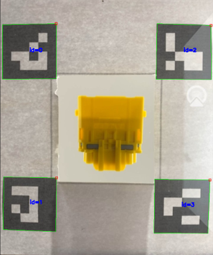
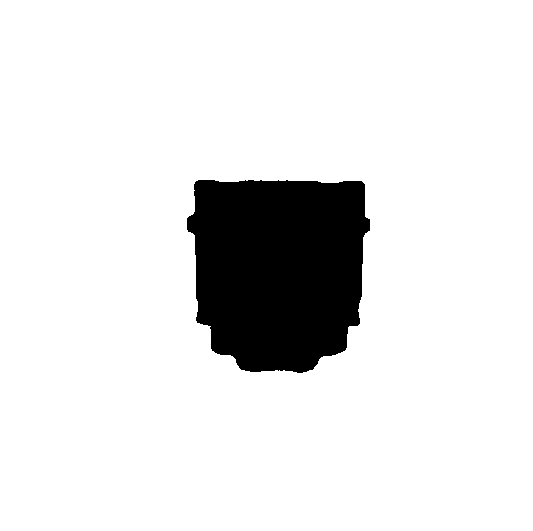
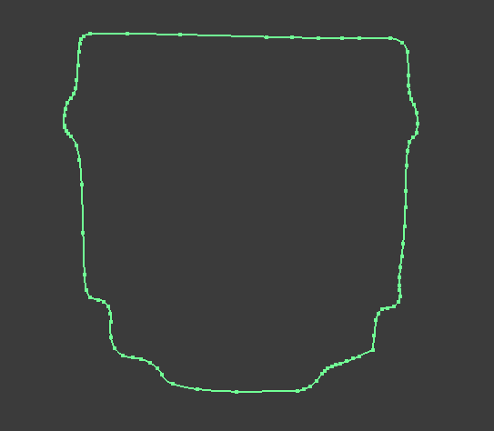

# FastFlow

FastFlow is a complete capture-to-CAD system that turns a phone-captured object into production-ready CAD geometry in minutes instead of hours.
And it solves a practical engineering problem: converting the contour of a real object into CAD geometry quickly, reliably, and with as little repetitive operator work as possible.

It started from a simple observation: real workshop and prototyping tasks often need a physical shape turned into CAD geometry, but that step is slow and sensitive to user skill. Manual tracing is tedious, edge-detection approaches are fragile, and pure software tools rarely fit cleanly into the CAD workflow.

The project is designed around a complete capture-to-CAD chain. 
The phone captures the object over an ArUco reference plane inside a transparent acrylic rig. The mirrored screen is then processed in Python for marker-based calibration, object segmentation with MobileSAM, mask preparation, and vectorization to DXF with Potrace. On the CAD side, the SolidWorks add-in takes over and applies downstream operations directly inside the part or assembly environment.

That design choice matters because the goal is not only to generate a contour, but to reduce friction in the actual engineering workflow.

The system combines a physical capture rig and a software pipeline:

- A smartphone observes the object inside a transparent acrylic rig.
- ArUco markers provide the geometric reference plane.
- A Python pipeline handles calibration, segmentation, mask cleanup, and vectorization.
- A SolidWorks add-in handles image insertion, AutoTrace, scale and offset, cuts, and part insertion.

The result is a workflow that feels like a single tool instead of several disconnected scripts.

**Why it matters:** Instead of manually tracing contours, checking scale repeatedly, and switching between tools, FastFlow keeps the entire workflow connected and automated. The system achieves ~0.3 mm measurement accuracy and reduces operator friction at every step.

## Getting Started

### Prerequisites

- Windows machine with SolidWorks installed (Solidworks FRENCH VERSION)
- Android phone for scrcpy capture
- Python environment for the vision pipeline
- The rig files and add-in files from the repository

## First Time Setup
> **⚠️ IMPORTANT:** All files must be extracted and placed in `C:/CP files`. The Python pipeline and add-in configuration depend on this exact path structure.

Follow these steps in order:

1. **Extract all files** to `C:/CP files`

2. **Download external dependencies** MobileSAM, Potrace, scrcpy, etc.


3. **Install the Python environment**
   - Run `Automatic_python_installer.bat`  

4. **Install the SolidWorks Add-in**
   - Navigate to `C:\CP files\Addin_Installer\`
   - Run `setup.exe`
   - Follow the installer wizard to completion

5. **Prepare your Android phone**
   - Open Settings → Developer Options
   - Enable **USB Debugging**
   - Enable **Developer Options** (may require tapping Build Number 7 times first)
   - Connect the phone to your workstation via USB

6. **Activate the add-in in SolidWorks**
   - Open SolidWorks
   - Go to **Tools → Add-ins**
   - Check the boxes for:
     - **AutoTrace**
     - **FastFlow InspireTech**
   - Click **OK**

7. **You're ready to use FastFlow**
   - Place your phone in the rig
   - Open SolidWorks and click `Run Python` to begin

### Make it work

1. Place the phone in the rig.
2. Start the mirrored capture with scrcpy.
3. Open SolidWorks and load the FastFlow add-in.
4. Click `Run Python`.
5. Select the mirrored window and click on the object.
6. Review the segmentation result and retry if needed.
7. Insert the image, scale it, and continue with the CAD commands.

## System Overview

FastFlow is a two-part system:

1. A physical acquisition rig that standardizes capture geometry.
2. A software chain that converts the captured object into CAD-ready output.

### Hardware: The Acquisition Rig

The rig is a laser-cut transparent acrylic structure that creates a repeatable capture volume.

- The object sits on the reference plane in a controlled position.
- A printed ArUco reference plane provides stable calibration markers.
- **The phone is mounted at the bottom of the rig pointing upward**, viewing the object flush with the reference plane. This geometry eliminates Z-axis parallax and ensures accurate scale measurement.
- The transparent design keeps the setup practical while preserving the reference plane visibility.

The rig is important because the rest of the pipeline depends on consistent geometry. Without stable capture conditions, calibration and segmentation become less reliable. The camera-flush-to-plane positioning is essential for dimensional accuracy.


### Software: Python and SolidWorks

**Python vision module** (`process_main.py`):

- Mirrors the phone screen with scrcpy.
- Detects the ArUco markers and computes the homography.
- Warps the image to a fronto-parallel view.
- Runs MobileSAM segmentation with a point prompt.
- Prepares the mask for vectorization.
- Uses Potrace to produce a DXF contour.

**SolidWorks add-in** (`TestAddin/`):

- Exposes workflow commands through a CAD-native interface.
- Runs the Python pipeline from inside SolidWorks.
- Inserts the traced image and uses AutoTrace.
- Applies scaling, offset, cuts, and part insertion.
- Supports the enclosure workflow with lock, sensor, and cover components.

## Workflow Diagram

```text
┌───────────────────┐     Click      ┌───────────────────┐     Detects 4     ┌───────────────────┐
│ Put Phone in Rig  │  "Run Python"  │  ArUco Detection  │    ArUco markers  │   Capture Photo   │
│                   │───────────────►│                   │─────────────────► │                   │
└───────────────────┘                └───────────────────┘                   └─────────┬─────────┘
                                        ┌─────────────────────────────────────────────►│
                                        │                                              ▼
                                        │                                ┌──────────────────────────┐
                                        │                                │  Homography + Warping    │
                                        │                                │   (Fronto-parallel)      │
                                        │                                └─────────┬────────────────┘
                                        │                                          │   Click 
                                        │                                          │ on object
                                        │                                          ▼
                                        │                                ┌───────────────────┐
                                        │                                │     MobileSAM     │
                                        │                                │ (multimask output)│
                                        │                                └─────────┬─────────┘
                                        │                                          │
                                        │                           ┌──────────────┴──────────────┐
                                        │                           │                             │
                                        │     retry       ┌─────────┴─────────┐         ┌─────────┴─────────┐
                                        └─────────────────│ Contour not good? │         │   Contour good    │
                                                          └───────────────────┘         └─────────┬─────────┘
                                                                                                  │
                                                                                                  │
                                                                                                  ▼
                                                                                        ┌───────────────────┐
                                                                                        │ Mask Preparation  │
                                                                                        │(invert, normalize)│
                                                                                        └─────────┬─────────┘
                                                                                                  │ 
                                                                                                  ▼
                                                                                        ┌───────────────────┐
                                                                                        │      Potrace      │
                                                                                        │    (BMP -> DXF)   │
                                                                                        └─────────┬─────────┘
                                                                                                  │
                                                                                                  ├──────────────────────────────────────────┐
                                                                                                  │                                          │
                                                                                                  ▼                                          ▼
                                                                                        ┌────────────────────┐                     ┌───────────────────┐
                                                                                        │ DXF Output File    │                     │  Insert Image +   │
                                                                                        │(Potrace result)    │                     │ AutoTrace in SW   │
                                                                                        │                    │                     └─────────┬─────────┘
                                                                                        │(OPTIONAL)          │                               │
                                                                                        │Direct import to CAD│                               ▼
                                                                                        └────────────────────┘                     ┌───────────────────┐
                                                                                                                                   │ AutoTrace creates │
                                                                                                                                   │  Contour Sketch   │
                                                                                                                                   └─────────┬─────────┘
                                                                                                                                             │
                                                                                                                                             ▼
                                                                                                                                   ┌───────────────────┐
                                                                                                                                   │  Scale & Offset   │
                                                                                                                                   │(auto + tolerance) │
                                                                                                                                   └─────────┬─────────┘
                                                                                                                                             │
                                                                                                                                             ▼
                                                                                                                                   ┌───────────────────┐
                                                                                                                                   │    Create Box     │
                                                                                                                                   │ (base enclosure)  │
                                                                                                                                   └─────────┬─────────┘
                                                                                                                                             │
                                                                                                                                             ▼
                                                                                                                                   ┌───────────────────┐
                                                                                                                                   │        Cut        │
                                                                                                                                   │ from traced sketch│
                                                                                                                                   └─────────┬─────────┘
                                                                                                                                             │
                                                                                                                                             ▼
                                                                                                                                   ┌───────────────────┐
                                                                                                                                   │    Insert Lock    │
                                                                                                                                   │  (left or right)  │
                                                                                                                                   └─────────┬─────────┘
                                                                                                                                             │
                                                                                                                                             ▼
                                                                                                                                   ┌───────────────────┐
                                                                                                                                   │ Sensor Placeholder│
                                                                                                                                   │(subtract workflow)│
                                                                                                                                   └─────────┬──────────┘
                                                                                                                                             │
                                                                                                                                             ▼
                                                                                                                                   ┌───────────────────┐
                                                                                                                                   │Insert Sensor Cover│
                                                                                                                                   │(assembly complete)│
                                                                                                                                   └─────────┬─────────┘
                                                                                                                                             │
                                                                                                                                             ▼
                                                                                                                                   ┌───────────────────┐
                                                                                                                                   │3D Enclosure Design│
                                                                                                                                   │   FINAL OUTPUT    │
                                                                                                                                   └───────────────────┘
                                                                                        
```

## Add-In Commands

The add-in exposes the workflow as a small set of commands that map directly to the actual process.


### `CreateBox`

- Creates the base enclosure geometry.
- Starts the CAD-side part structure.

### `Run Python`

- Launches the full vision pipeline from inside SolidWorks.
- Produces the mask, scale, and DXF artifacts.

### `Insert Image`

- Inserts the generated segmentation mask as a sketch picture.
- Prepares the image for AutoTrace.

### `Scale & Offset`

- Reads the generated scale factor.
- Applies the transform needed to match real-world dimensions.

### `Cut`

- Turns the traced sketch into a cut feature.
- Uses the user-defined depth.

### `Insert Lock`

- Inserts the left or right lock body.
- Supports the YokePoke enclosure workflow.

### `Insert Sensor`

- Inserts the sensor placeholder body.
- Supports the subtract workflow used in the design.

### `Insert Sensor Cover`

- Inserts the cover body for the sensor assembly.
- Completes the enclosure sequence.

## Technical Architecture

### Python Vision Module

The Python side is responsible for image acquisition, calibration, segmentation, and vectorization.

**Acquisition**:

- scrcpy mirrors the phone screen to the workstation.
- The mirrored feed acts as the input source for the pipeline.



**ArUco Detection and Homography**:

- Four markers on the reference plane define the calibration basis.
- Their corners are used to compute a fronto-parallel warp.
- That warp reduces perspective distortion before segmentation.


**MobileSAM Segmentation**:

- The lightweight MobileSAM checkpoint is used for prompt-driven segmentation.
- The user clicks the object once the warped image is visible.
- The best candidate mask is selected from the model output.


**Mask Cleanup**:

- The output mask is inverted and normalized.
- The goal is to make the bitmap clean enough for vectorization.



**Potrace Vectorization**:

- Potrace converts the bitmap into a DXF contour.
- The result can be imported directly into CAD if needed.



### SolidWorks Add-In Module

The C# add-in provides the CAD-facing workflow.

- It exposes the commands in the order the operator needs them.
- It triggers Python processing from within SolidWorks.
- It inserts the generated image, runs AutoTrace, and applies transforms.
- It carries the enclosure logic that ties the box, lock, sensor, and cover together.


### File-Based Bridge

The integration between Python and SolidWorks is intentionally file-based.

- `images/mask.png` stores the segmented contour image.
- `width_scale.txt` stores the scale factor.
- `DXF/Dxf real measure.dxf` stores the vector output.

This keeps the system easy to debug and makes the handoff between modules deterministic.

### Deployment

Deployment is handled as part of the engineering work, not as an afterthought.

- The Python environment can be prepared with the provided setup files.
- The SolidWorks add-in is packaged for repeatable installation.
- An `.msi` installer was also created to make deployment easier on target machines.


## Limitations

FastFlow works best when the capture conditions are controlled.

- Reflections and glare can reduce marker and mask quality.
- Different phone cameras can behave differently.
- Objects that are not close to the assumed plane can introduce drift.
- Some spline-heavy CAD operations may still need manual cleanup.

These limits do not break the workflow, but they define where the next improvements should focus.


## Project Structure

```text
├── README.md
├── requirements.txt
├── process_main.py
├── grab_phone_screen.py
├── width_scale.txt
├── Automatic_python_installer.bat
├── Addin Source Code/
├── Addin_Installer/
├── DXF/
├── images/
├── Rig/
├── screenshots/
├── SolidParts/
├── tcl/   
│
│   # ── External dependencies (not included) 
├── MobileSAM/          # https://github.com/ChaoningZhang/MobileSAM
├── scrcpy-win64-v3.3.1 # https://github.com/Genymobile/scrcpy/releases
├── python-3.13.0-amd64.exe # https://www.python.org/downloads/release/python-3130/
├── mobile_sam.pt https://github.com/ChaoningZhang/MobileSAM/blob/master/weights/mobile_sam.pt
└── potrace-1.16.win64/ # https://potrace.sourceforge.net

```
## Future Work

The next improvements are mostly about robustness and packaging.

1. Improve lighting with a bottom-diffused setup.
2. Expand cross-device calibration and validation.
3. Reduce manual retry points in the segmentation flow.
4. Harden the installer and deployment process.
5. Explore a dedicated camera instead of a phone.

## Why This Exists

FastFlow exists because the path from object capture to CAD should feel engineered, not improvised. It is a workflow project as much as it is a vision project: the hardware, Python pipeline, and SolidWorks add-in all exist to make one repetitive task faster, cleaner, and more repeatable.
